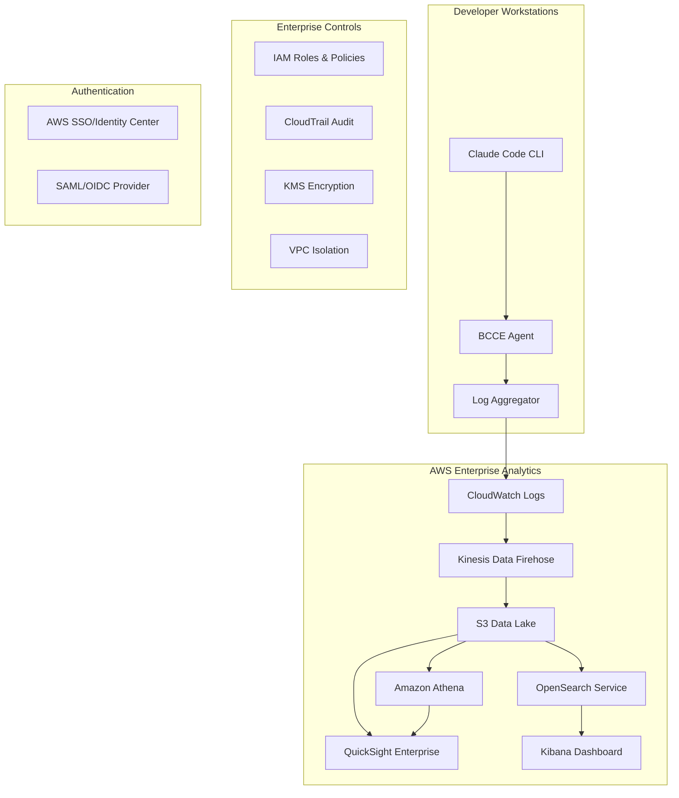

# Enterprise Analytics Architecture for BCCE

## Executive Summary

This document defines the enterprise-grade analytics architecture for BCCE, addressing security, compliance, scalability, and AWS-native deployment patterns for Fortune 500 organizations.

## Current State Analysis

### Sniffly Limitations for Enterprise
- **Local-only deployment**: Desktop analytics tool, not enterprise-scalable
- **No authentication**: Open dashboard accessible to anyone on localhost
- **Client-side processing**: Logs processed locally, no centralized governance
- **Limited audit controls**: No enterprise audit trails or access controls
- **No multi-tenant support**: Single-user analytics model

### Enterprise Requirements Gap
- **Multi-user access control** with role-based permissions
- **Centralized log aggregation** across teams and projects
- **Compliance-grade audit trails** with immutable logging
- **Integration with enterprise identity** (SSO, SAML, OIDC)
- **Data residency controls** and encryption at rest/transit
- **Scalable architecture** supporting thousands of users

## Recommended Enterprise Analytics Architecture

### 1. AWS-Native Analytics Infrastructure



### 2. Analytics Deployment Models

#### Model A: Centralized Enterprise Analytics
**Best for: Large enterprises (1000+ developers)**

```yaml
architecture: centralized
components:
  - aws_quicksight_enterprise
  - s3_data_lake_centralized
  - opensearch_service_managed
  - cloudwatch_logs_aggregated
security:
  - aws_sso_integration
  - rbac_enterprise_controls
  - data_lake_encryption
cost: $15-25k/month
compliance: SOC2, HIPAA, PCI-DSS ready
```

#### Model B: Team-Based Analytics Pods
**Best for: Medium enterprises (100-1000 developers)**

```yaml
architecture: federated_pods
components:
  - team_isolated_quicksight
  - project_scoped_s3_buckets
  - opensearch_per_team
deployment: per_team_aws_account
security:
  - cross_account_iam_roles
  - team_level_encryption
cost: $2-5k/month per team
compliance: Configurable per team
```

#### Model C: Developer-Local with Enterprise Sync
**Best for: Small-medium enterprises (10-100 developers)**

```yaml
architecture: hybrid_local_enterprise
components:
  - local_sniffly_enhanced
  - secure_log_sync_to_s3
  - centralized_compliance_reporting
security:
  - encrypted_log_transmission
  - local_data_retention_policies
cost: $500-2k/month
compliance: Basic enterprise controls
```

### 3. Enterprise Security Framework

#### Authentication & Authorization
```typescript
interface EnterpriseAuth {
  identityProvider: 'aws-sso' | 'okta' | 'azure-ad' | 'custom-saml';
  rbac: {
    roles: ['admin', 'team-lead', 'developer', 'auditor', 'executive'];
    permissions: ['view-own', 'view-team', 'view-all', 'export', 'admin'];
    dataAccess: 'project-scoped' | 'team-scoped' | 'org-wide';
  };
  sessionManagement: {
    timeout: number;
    mfa: boolean;
    deviceTrust: boolean;
  };
}
```

#### Data Protection Controls
```typescript
interface DataProtection {
  encryption: {
    atRest: 'aws-kms' | 'customer-managed';
    inTransit: 'tls-1.3';
    keyRotation: 'automatic';
  };
  dataClassification: {
    levels: ['public', 'internal', 'confidential', 'restricted'];
    retention: Record<string, number>; // days
    purgePolicy: 'automatic' | 'manual-approval';
  };
  auditLogging: {
    level: 'comprehensive';
    storage: 's3-immutable';
    retention: number; // 7 years for compliance
  };
}
```

### 4. AWS Service Integration Strategy

#### Core Analytics Stack
```yaml
log_ingestion:
  service: amazon_kinesis_data_firehose
  features:
    - real_time_streaming
    - automatic_batching
    - format_conversion
    - compression

data_storage:
  service: amazon_s3
  configuration:
    - intelligent_tiering
    - lifecycle_policies
    - cross_region_replication
    - versioning_enabled

analytics_engine:
  primary: amazon_athena
  secondary: amazon_opensearch
  features:
    - serverless_scaling
    - sql_queries
    - federated_queries

visualization:
  service: amazon_quicksight_enterprise
  features:
    - embedded_dashboards
    - mobile_access
    - ml_insights
    - enterprise_security
```

#### Cost Optimization
```yaml
cost_controls:
  s3_storage:
    - intelligent_tiering: auto
    - lifecycle_policies: 90d_to_ia, 365d_to_glacier
  
  quicksight:
    - capacity_pricing: enterprise_volume_discount
    - usage_based_scaling: automatic
  
  athena:
    - query_result_caching: enabled
    - partition_projection: automatic
  
  opensearch:
    - reserved_instances: for_predictable_workloads
    - auto_scaling: enabled
```

### 5. Implementation Roadmap

#### Phase 1: Foundation (Weeks 1-4)
- [ ] AWS infrastructure setup (CloudFormation templates)
- [ ] IAM roles and policies configuration
- [ ] S3 data lake architecture
- [ ] CloudWatch Logs integration
- [ ] Basic Athena query setup

#### Phase 2: Authentication (Weeks 5-6)
- [ ] AWS SSO integration
- [ ] RBAC implementation
- [ ] Session management
- [ ] API authentication for CLI

#### Phase 3: Analytics Platform (Weeks 7-10)
- [ ] QuickSight dashboard development
- [ ] OpenSearch Service setup
- [ ] Kibana dashboard configuration
- [ ] Real-time streaming pipeline

#### Phase 4: Enterprise Features (Weeks 11-12)
- [ ] Compliance reporting automation
- [ ] Advanced security controls
- [ ] Cost optimization implementation
- [ ] Multi-tenant support

### 6. Compliance & Governance

#### SOC2 Type II Requirements
```yaml
controls:
  cc6_1_logical_access:
    - multi_factor_authentication
    - role_based_access_control
    - session_timeout_policies
  
  cc6_7_data_retention:
    - automated_retention_policies
    - secure_data_disposal
    - audit_trail_preservation
  
  cc7_1_system_monitoring:
    - real_time_monitoring
    - automated_alerting
    - incident_response_procedures
```

#### HIPAA Compliance (if applicable)
```yaml
hipaa_controls:
  administrative_safeguards:
    - workforce_training
    - access_management
    - incident_procedures
  
  physical_safeguards:
    - aws_physical_security
    - workstation_controls
    - device_controls
  
  technical_safeguards:
    - access_control
    - audit_controls
    - integrity_controls
    - transmission_security
```

### 7. Migration Strategy from Current Sniffly

#### Option A: Gradual Migration
1. **Keep Sniffly for development** (local analytics)
2. **Add enterprise sync** (secure log upload to AWS)
3. **Pilot team adoption** (QuickSight dashboards)
4. **Organization rollout** (full enterprise analytics)

#### Option B: Clean Break
1. **Build enterprise analytics first** (AWS-native)
2. **Create Sniffly compatibility layer** (same data format)
3. **Migration tools** (historical data import)
4. **Sunset local Sniffly** (enterprise-only)

#### Option C: Hybrid Approach (Recommended)
1. **Enhanced Sniffly** with enterprise sync capabilities
2. **AWS analytics overlay** for governance and compliance
3. **Developer choice** (local vs cloud analytics)
4. **Centralized compliance reporting** regardless of choice

### 8. Cost Analysis

#### Enterprise Analytics TCO (3-year)
```yaml
model_a_centralized:
  setup_cost: $50k
  annual_aws_costs: $180k  # QuickSight Enterprise + S3 + Athena
  operational_costs: $120k # 1 FTE admin
  total_3_year: $950k

model_b_federated:
  setup_cost: $30k
  annual_aws_costs: $60k   # Distributed across teams
  operational_costs: $60k  # 0.5 FTE admin
  total_3_year: $330k

model_c_hybrid:
  setup_cost: $15k
  annual_aws_costs: $24k   # Basic compliance layer
  operational_costs: $30k  # 0.25 FTE admin
  total_3_year: $177k
```

### 9. Success Metrics

#### Technical Metrics
- **Query performance**: <5s for standard dashboards
- **Data freshness**: <15 min lag for real-time metrics
- **Availability**: 99.9% uptime SLA
- **Scale**: Support 10k+ concurrent users

#### Business Metrics
- **Compliance readiness**: 100% audit pass rate
- **Cost optimization**: 25%+ reduction in AI workflow costs
- **Developer adoption**: 90%+ team participation
- **Executive visibility**: Monthly governance reports

### 10. Recommendations

#### Immediate Actions (Next 30 Days)
1. **Choose deployment model** based on organization size
2. **Assess current AWS infrastructure** capacity
3. **Define RBAC requirements** with security team
4. **Plan pilot team selection** for initial rollout

#### Strategic Decisions Required
1. **Data residency requirements** (regional AWS deployment)
2. **Integration with existing BI tools** (Tableau, PowerBI)
3. **Custom vs. standard dashboards** for executives
4. **Real-time vs. batch processing** for cost optimization

The enterprise analytics architecture must prioritize **security, scalability, and compliance** while providing the rich insights executives need for AI governance decisions. The hybrid approach offers the best balance of developer experience and enterprise control.