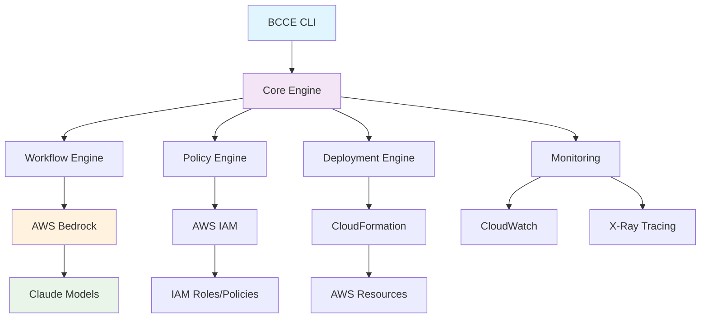
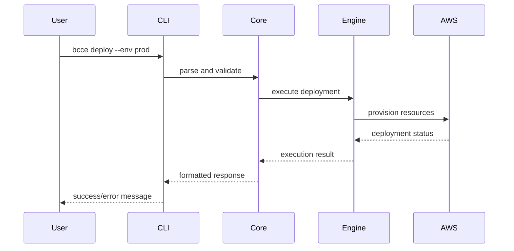
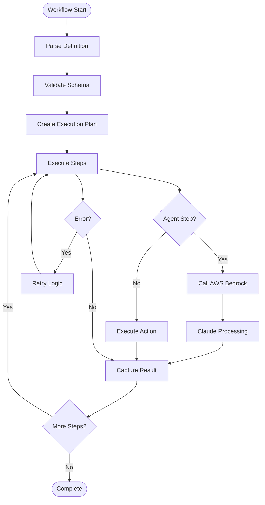
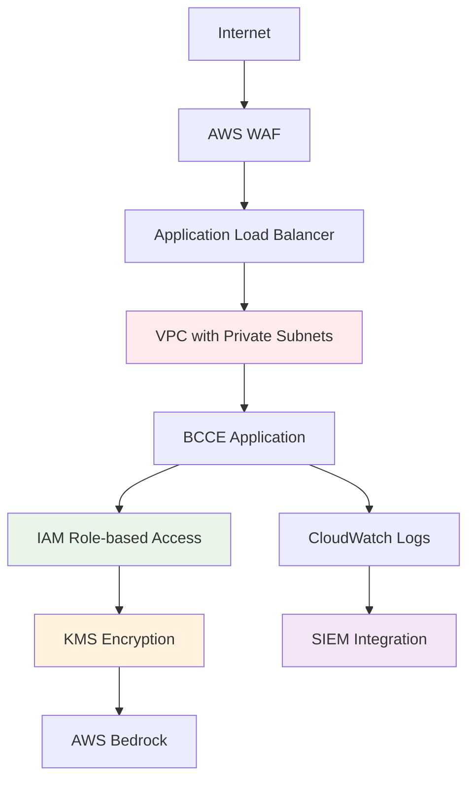
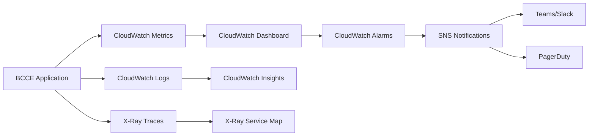
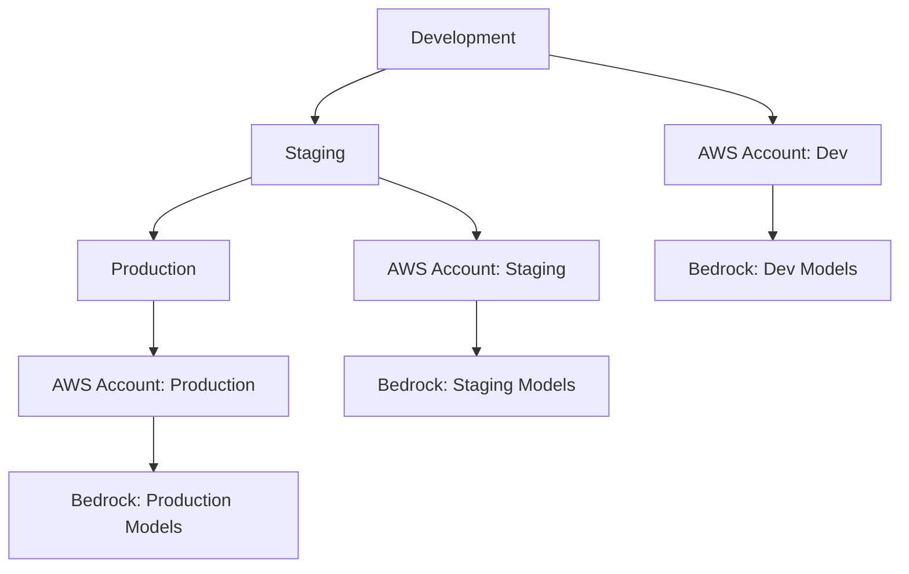

# BCCE Architecture

Understanding BCCE's architecture helps you make the most of its capabilities and deploy it effectively in enterprise environments.

## Overview

BCCE follows a modular, cloud-native architecture designed for scalability, security, and maintainability:



## Core Components

### 1. CLI Interface

The command-line interface provides the primary user interaction point:

```typescript
// CLI Architecture
interface CLICommand {
  name: string;
  description: string;
  execute(args: CommandArgs): Promise<Result>;
}

// Command Registry
const commands = [
  new InitCommand(),
  new DeployCommand(),
  new WorkflowCommand(),
  new PolicyCommand(),
  new DoctorCommand()
];
```

**Key Features:**
- Type-safe command definitions
- Consistent error handling
- Rich help system
- Plugin architecture for extensions

### 2. Core Engine

The core engine orchestrates all BCCE operations:

```typescript
class BCCECore {
  private config: ConfigManager;
  private workflows: WorkflowEngine;
  private policies: PolicyEngine;
  private deployment: DeploymentEngine;
  private monitoring: MonitoringService;
  
  async execute(command: Command): Promise<Result> {
    // Unified execution pipeline
  }
}
```

**Responsibilities:**
- Configuration management
- Cross-cutting concerns (logging, metrics)
- Error handling and recovery
- Resource lifecycle management

### 3. Workflow Engine

Executes Claude-powered workflows with advanced orchestration:

```yaml
# Workflow Definition
version: "1.0"
name: "code-review"
steps:
  - name: "analyze"
    type: "agent"
    parallel: false
    retry:
      attempts: 3
      backoff: exponential
    
  - name: "summarize"
    type: "agent"
    depends_on: ["analyze"]
    context:
      previous_output: "{{steps.analyze.output}}"
```

**Features:**
- Parallel execution
- Dependency management
- Error recovery
- Context passing
- State persistence

### 4. Policy Engine

Manages AWS IAM policies and security controls:

```typescript
interface PolicyEngine {
  generatePolicy(requirements: SecurityRequirements): IAMPolicy;
  validatePermissions(policy: IAMPolicy): ValidationResult;
  enforceCompliance(deployment: Deployment): ComplianceResult;
}
```

**Security Controls:**
- Least privilege access
- Resource-based policies
- Compliance frameworks
- Audit logging

### 5. Deployment Engine

Handles AWS resource provisioning and management:

```typescript
class DeploymentEngine {
  async deploy(config: DeploymentConfig): Promise<DeploymentResult> {
    // 1. Validate configuration
    // 2. Generate CloudFormation/CDK
    // 3. Deploy infrastructure
    // 4. Configure services
    // 5. Verify deployment
  }
}
```

## Data Flow

### 1. Command Execution Flow



### 2. Workflow Execution Flow



## Security Architecture

### Defense in Depth

BCCE implements multiple security layers:



### Security Controls

1. **Network Security**
   - VPC isolation
   - Private subnets
   - Security groups
   - NACLs

2. **Identity & Access**
   - IAM roles and policies
   - Cross-account access
   - MFA enforcement
   - Temporary credentials

3. **Data Protection**
   - Encryption in transit (TLS 1.3)
   - Encryption at rest (KMS)
   - Data classification
   - PII handling

4. **Monitoring & Compliance**
   - Real-time monitoring
   - Audit logging
   - Compliance scanning
   - Threat detection

## Scalability Design

### Horizontal Scaling

BCCE scales across multiple dimensions:

```typescript
interface ScalingConfig {
  // Workflow concurrency
  maxConcurrentWorkflows: number;
  
  // Step parallelization
  maxParallelSteps: number;
  
  // Resource limits
  memoryLimits: ResourceLimits;
  cpuLimits: ResourceLimits;
  
  // AWS service limits
  bedrockLimits: ServiceLimits;
}
```

### Performance Optimization

1. **Caching Strategy**
   - Configuration caching
   - Model response caching
   - Resource state caching

2. **Connection Pooling**
   - AWS SDK connection reuse
   - HTTP/2 multiplexing
   - Connection warming

3. **Asynchronous Processing**
   - Non-blocking I/O
   - Promise-based APIs
   - Stream processing

## Monitoring Architecture

### Observability Stack



### Key Metrics

1. **Performance Metrics**
   - Command execution time
   - Workflow completion time
   - API response time
   - Error rates

2. **Business Metrics**
   - Workflow success rate
   - Model usage
   - Cost per execution
   - User adoption

3. **Infrastructure Metrics**
   - CPU/Memory usage
   - Network I/O
   - Storage usage
   - AWS service quotas

## Integration Patterns

### AWS Services Integration

```typescript
interface AWSIntegrations {
  bedrock: BedrockService;
  iam: IAMService;
  cloudformation: CloudFormationService;
  cloudwatch: CloudWatchService;
  xray: XRayService;
  kms: KMSService;
  secrets: SecretsManagerService;
}
```

### External Integrations

1. **CI/CD Platforms**
   - GitHub Actions
   - GitLab CI
   - Jenkins
   - Azure DevOps

2. **Communication**
   - Slack
   - Microsoft Teams
   - Email (SES)
   - PagerDuty

3. **Development Tools**
   - Git repositories
   - Issue trackers
   - Documentation systems
   - IDE plugins

## Extension Architecture

### Plugin System

```typescript
interface BCCEPlugin {
  name: string;
  version: string;
  
  initialize(context: PluginContext): Promise<void>;
  registerCommands(): Command[];
  registerWorkflowSteps(): WorkflowStep[];
}

// Plugin Registration
const pluginManager = new PluginManager();
pluginManager.register(new CustomSecurityPlugin());
pluginManager.register(new CompanyWorkflowPlugin());
```

### Custom Step Types

```yaml
# Custom workflow step
steps:
  - name: "custom-validation"
    type: "company:security-scan"
    config:
      scanner: "internal-tool"
      severity: "high"
```

## Deployment Patterns

### Multi-Environment Architecture



### Enterprise Deployment Options

1. **Single Account**
   - Environment separation via regions
   - Resource tagging for cost allocation
   - Shared IAM policies

2. **Multi-Account**
   - AWS Organizations
   - Cross-account roles
   - Centralized billing

3. **Hybrid Cloud**
   - On-premises integration
   - VPN/Direct Connect
   - Hybrid identity

## Configuration Management

### Hierarchical Configuration

```yaml
# Global config (bcce.config.yaml)
version: "1.0"
name: "my-project"

# Environment-specific config
environments:
  dev:
    aws:
      region: "us-west-2"
      profile: "dev"
  prod:
    aws:
      region: "us-east-1" 
      profile: "prod"
```

### Configuration Sources

1. **File-based**: YAML/JSON configuration files
2. **Environment Variables**: Runtime configuration
3. **AWS Parameter Store**: Centralized configuration
4. **AWS Secrets Manager**: Sensitive configuration

---

This architecture enables BCCE to deliver enterprise-grade performance, security, and scalability while maintaining developer-friendly simplicity.